# Work Track Project Structure Diagram

## System Architecture Overview

```mermaid
graph TB
    subgraph "Client Layer"
        Browser["🌐 Web Browser"]
    end
    
    subgraph "Presentation Layer"
        Auth["🔐 Authentication<br/>(login.php)"]
        Views["📋 View Pages"]
        Views --> Calendar["📅 Calendar View<br/>(calendar.php)"]
        Views --> Kanban["📊 Kanban Board<br/>(kanban.php)"]
        Views --> Gantt["📈 Gantt Chart<br/>(gantt.php)"]
        Views --> Projects["📁 Projects List<br/>(projects.php)"]
        Views --> Reports["📊 Reports<br/>(reports.php)"]
    end
    
    subgraph "Business Logic Layer"
        Models["🏗️ Data Models"]
        Models --> ClientModel["Client Model<br/>(Client.php)"]
        Models --> ProjectModel["Project Model<br/>(Project.php)"]
        Models --> StatusModel["Status Model<br/>(ProjectStatus.php)"]
        Models --> TemplateModel["Template Model<br/>(ProjectTemplate.php)"]
        
        Includes["⚙️ Core Functions"]
        Includes --> AuthFunc["auth.php<br/>Session Management"]
        Includes --> DBFunc["db.php<br/>Database Connection"]
        Includes --> Helpers["helpers.php<br/>Utility Functions"]
    end
    
    subgraph "API Layer"
        API["🔌 API Endpoints"]
        API --> GetProject["get_project.php"]
        API --> UpdateProject["update_project.php"]
        API --> DeleteProject["delete_project.php"]
        API --> UpdateStatus["update_status.php"]
        API --> Upload["upload_file.php"]
        API --> CalFeed["calendar_feed.php"]
    end
    
    subgraph "Data Layer"
        DB[("💾 SQLite Database<br/>work_track.db")]
        Tables["📊 Database Tables"]
        Tables --> Users["users"]
        Tables --> Clients["clients"]
        Tables --> ProjectsTable["projects"]
        Tables --> Files["project_files"]
        Tables --> Templates["project_templates"]
    end
    
    subgraph "Static Resources"
        CSS["🎨 Styles<br/>(style.css)"]
        JS["📜 JavaScript<br/>(main.js)"]
        Images["🖼️ Images"]
    end
    
    Browser -->|HTTP Request| Auth
    Auth -->|Success| Views
    Views -->|Include| Models
    Views -->|AJAX| API
    Models -->|Query| DB
    API -->|Query| DB
    Views -->|Load| CSS
    Views -->|Load| JS
    Views -->|Load| Images
```



## Directory Structure

```
work_track/
├── 📁 api/                      # API endpoints for AJAX operations
│   ├── calendar_feed.php        # iCal feed generator
│   ├── delete_project.php       # Project deletion
│   ├── get_project.php          # Fetch project details
│   ├── update_project.php       # Update project data
│   ├── update_status.php        # Status updates
│   └── upload_file.php          # File upload handler
│
├── 📁 backups/                  # Database backup storage
│
├── 📁 config/                   # Configuration files
│   └── config.php               # Database and app config
│
├── 📁 database/                 # Database files
│   ├── init.php                 # Database initialization
│   ├── schema.sql               # Database schema
│   └── work_track.db            # SQLite database
│
├── 📁 includes/                 # PHP includes and classes
│   ├── 📁 models/               # Data model classes
│   │   ├── Client.php           # Client management
│   │   ├── Project.php          # Project management
│   │   ├── ProjectStatus.php    # Status definitions
│   │   └── ProjectTemplate.php  # Template management
│   ├── auth.php                 # Authentication functions
│   ├── db.php                   # Database connection
│   ├── footer.php               # Page footer template
│   ├── header.php               # Page header template
│   └── helpers.php              # Utility functions
│
├── 📁 public/                   # Static assets
│   ├── 📁 css/                  # Stylesheets
│   │   └── style.css            # Main stylesheet
│   ├── 📁 images/               # Image assets
│   │   └── favicon.svg          # Site favicon
│   └── 📁 js/                   # JavaScript files
│       └── main.js              # Main JavaScript
│
├── 📁 sessions/                 # PHP session storage
│
├── 📁 uploads/                  # User uploaded files
│
├── 📁 views/                    # View templates (if any)
│
├── 📄 Core Pages
├── index.php                    # Dashboard/home page
├── login.php                    # User authentication
├── logout.php                   # Session termination
├── calendar.php                 # Monthly calendar view
├── kanban.php                   # Kanban board view
├── gantt.php                    # Gantt chart view
├── projects.php                 # Project list view
├── reports.php                  # Reporting interface
├── templates.php                # Project templates
├── users.php                    # User management
├── status.php                   # Status management
├── backup.php                   # Database backup utility
├── calendar-sync.php            # Calendar sync settings
├── .htaccess                    # Apache configuration
└── CLAUDE.md                    # Development guidelines
```

## Data Flow

### 1. **User Authentication Flow**
```
User → login.php → auth.php → Database → Session → Dashboard
```

### 2. **Project Management Flow**
```
User Action → View Page → AJAX Request → API Endpoint → Model → Database
                ↓
            JavaScript → DOM Update → User Feedback
```

### 3. **Calendar/Kanban Drag & Drop Flow**
```
Drag Event → JavaScript Handler → AJAX Call → update_status.php/update_project.php
                ↓                                       ↓
            DOM Preview                          Database Update
                ↓                                       ↓
            Success Callback ← ← ← ← ← ← ← ← JSON Response
```

## Key Components

### Frontend Components
- **Drag & Drop**: Native HTML5 drag-and-drop for project cards
- **Calendar**: Monthly view with draggable project cards
- **Kanban**: Status-based columns with drag-to-update
- **Gantt**: Timeline visualization with project bars
- **Responsive Design**: Mobile-friendly layouts

### Backend Components
- **Session Management**: PHP sessions for authentication
- **Database Abstraction**: PDO for SQLite operations
- **Model Classes**: OOP approach for data management
- **API Endpoints**: RESTful-style JSON APIs

### Security Features
- Session-based authentication
- CSRF protection (if implemented)
- Prepared statements for SQL queries
- File upload validation
- Access control per user role

## Database Schema Overview

```sql
users
├── id (PRIMARY KEY)
├── username
├── password (hashed)
├── email
└── created_at

clients  
├── id (PRIMARY KEY)
├── name
├── address
├── phone
├── email
└── remarks

projects
├── id (PRIMARY KEY)
├── title
├── details
├── client_id (FOREIGN KEY)
├── start_date
├── completion_date
├── status
├── fabric
└── created_date

project_files
├── id (PRIMARY KEY)
├── project_id (FOREIGN KEY)
├── filename
├── filepath
└── uploaded_at

project_templates
├── id (PRIMARY KEY)
├── name
├── template_data
└── created_at
```

## Technology Stack Summary

| Layer | Technology | Purpose |
|-------|------------|----------|
| Frontend | HTML5, CSS3, JavaScript | User interface |
| Backend | PHP 8.1+ | Server-side logic |
| Database | SQLite | Data persistence |
| Server | Apache with .htaccess | Web server |
| Authentication | PHP Sessions | User management |
| API | JSON/AJAX | Async communication |
| Calendar Export | iCal format | External integration |